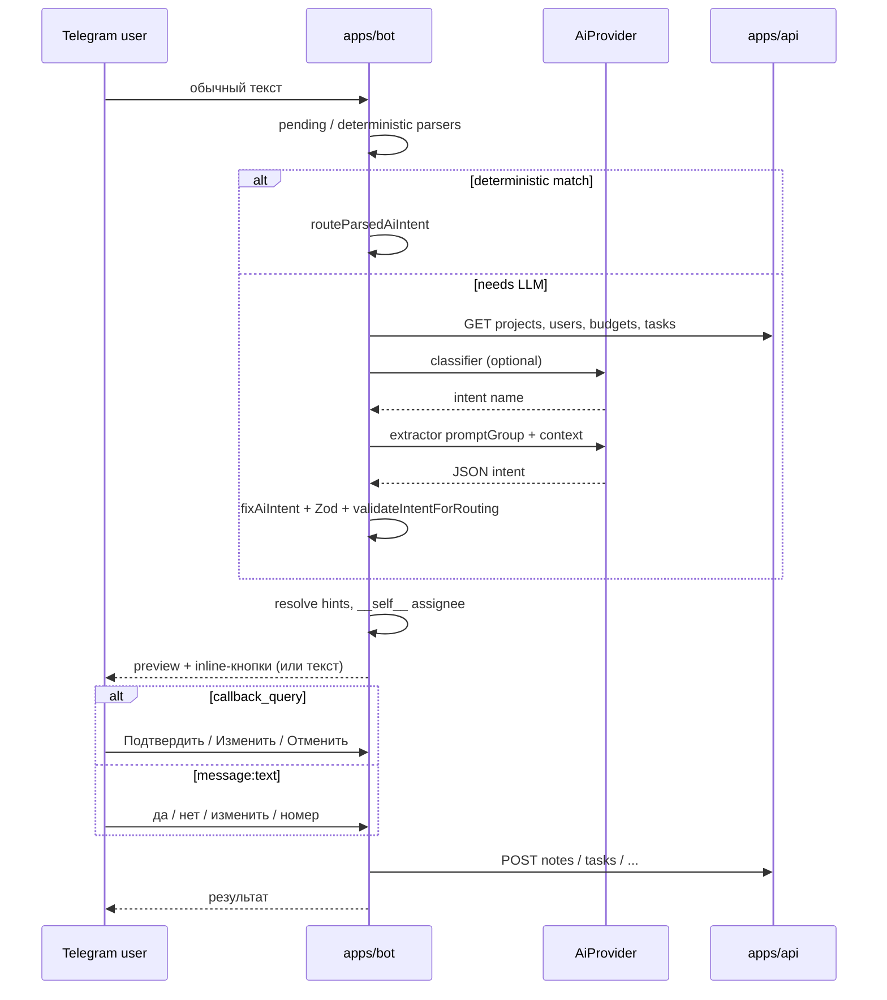

# AI intent (LLM + `@neportal/ai-contracts`)

Локальный MVP: Yandex Cloud используется **только как внешний API** (YandexGPT Foundation Models, Qwen в AI Studio, SpeechKit STT). Бот и API работают на `localhost`, без деплоя приложения в Yandex.

## Архитектура разбора текста

Обычный текст и **распознанный голос** в боте проходят **три слоя** (см. также [bot.md](bot.md#детерминированный-разбор-без-yandexgpt), [bot.md - голос](bot.md#голосовые-сообщения-speechkit)):

1. **Pending-состояния** - подтверждение и выбор: inline-кнопки (`callback_query`) или текст («да»/«нет», номер пункта, уточнение комментария и т.д.) - без GPT. См. [bot.md - Telegram UX](bot.md#telegram-ux-inline-кнопки).
2. **Детерминированные парсеры** - регулярные шаблоны и эвристики в `ai-message.ts` (списки задач, расходы, простое «создай задачу…», transfer/reassign) - **без** LLM.
3. **LLM** (`parseTextIntent` → `AiProvider.complete`) - двухэтапный разбор для остальных фраз, если env настроен.



Slash-команды (`/task`, `/note`, …) и голос **не** проходят через LLM напрямую: голос сначала превращается в текст через SpeechKit, затем идёт в `handleTextSemanticMessage`.

### AiProvider (`apps/bot/src/ai/provider/`)

| Компонент | Назначение |
|-----------|------------|
| `types.ts` | `AiProvider`, `AiCompletionParams`, `AiCompletionResult` |
| `registry.ts` | `AI_PROVIDER` → `getPrimaryAiProvider()`, `getAiProviderState()` |
| `yandex-provider.ts` | Foundation Models API (`llm.api.cloud.yandex.net`) |
| `qwen-provider.ts` | OpenAI-compatible API (`ai.api.cloud.yandex.net/v1`) |

Оркестрация: `yandex-gpt.ts` (`parseTextIntent`, `requestAiJson`). Entry point для состояния AI в боте: `getAiProviderState()` (не только Yandex env).

| `AI_PROVIDER` | Backend |
|---------------|---------|
| *(пусто)* / `yandex` | `createYandexGptProvider()` |
| `qwen` | `createQwenProvider()` (Yandex Cloud AI Studio) |
| неизвестное | warn + fallback на `yandex` |

### Маршрутизация промптов (`resolvePromptGroup`)

Файл: `apps/bot/src/ai/prompt-group-router.ts`.

По тексту пользователя бот выбирает **группу промпта** (`expense`, `absence`, `task-status`, `collaboration`, `task-list`, `create-task-rich`, `create-note` или `classifier`). Если группа **не** `classifier`, шаг classifier **пропускается** - сразу extractor этой группы.

Примеры маршрутизации без classifier: «мои задачи», «расходы без чеков», «потратил …», «создай задачу …», «закрыл задачу по складу …», transfer/reassign.

Контекст в prompt **компактный** по группе (`intent-context.ts`); бюджеты кэшируются in-memory TTL (`budget-context-cache.ts`). Лимит ответа: `ai/completion-max-tokens.ts` по `promptGroup`.

### Двухэтапный разбор (classifier + extractor)

Реализация: `apps/bot/src/yandex-gpt.ts`, промпты: `apps/bot/src/ai/prompts/`.

| Шаг | Что делает |
|-----|------------|
| 1. Classifier | Короткий JSON: `intent` + `confidence` (если `resolvePromptGroup` → `classifier`) |
| 2. Extractor | Полный JSON по группе с контекстом из API |
| Post-process | `fixAiIntentBeforeValidation` (даты, assignee «мне», title/description, transfer comment, …) |
| Validate | Zod (`safeParseAiIntent`) + `validateIntentForRouting` (в т.ч. `add_task_comment`) |
| Routing | `route-parsed-intent.ts` → resolver → preview |

Группы extractor ↔ intent: `intentToExtractorGroup()` в `apps/bot/src/ai/intent-to-prompt-group.ts`.

### Логирование токенов и отладка

- `[yandex-gpt] tokens provider=yandex|qwen promptGroup=… input=… output=… latencyMs=…` (`yandex-gpt-usage.ts`) - **один** лог на успешный completion (без дублей при retry).
- Итог за один `parseTextIntent`: `tokens parseTextIntent total`.
- При HTTP/transient ошибках: `ai-provider error` / `retry` с `code`, `status`, `retryable`, `attempts`, `requestId` (без API key и Authorization).
- Timeout/retry: `AI_PROVIDER_TIMEOUT_MS`, `AI_PROVIDER_MAX_RETRIES`, `AI_PROVIDER_RETRY_BASE_DELAY_MS` - см. [env.md](env.md).
- Диагностика: `getAiProviderState().diagnostics` (configured, model, endpoint, timeoutMs, maxRetries).
- При отказе модели / невалидной схеме - `BOT_YANDEX_PROMPT_LOG_DIR` (по умолчанию `logs/yandex-gpt`).
- `BOT_DEV_SELF_CHECKS=true` - self-checks (registry, hardening, assignee `__self__`, парсеры).
- `BOT_AI_CLEANUP_BASIC_TASKS` - LLM-очистка title (`cleanup-task-title.ts` → `requestAiJson`).

### Местоимения и `__self__`

Если пользователь говорит о себе («мне», «меня», «себе», «на меня»), модель может вернуть `assigneeHint` / `assigneeUserId` / `toUserHint` / `userHint` = `"__self__"`. Бот подставляет привязанного сотрудника (`resolve-user-from-ai-payload.ts`, `resolve-users-by-hint.ts`).

### create_task: исполнитель vs имена в задаче

- **assigneeHint** / **assigneeUserId** - кому назначают задачу; «мне» → `__self__` (модель может отдать только `assigneeUserId`, без hint).
- Имена **внутри действия** («уволить Васю», «позвонить Ивану») - часть `title`, не исполнитель.
- Post-processing (`fix-ai-intent-assignee.ts`): «поставь/создай/добавь мне задачу», «запиши мне в задачи» → `assigneeHint: "__self__"`.
- После parse, в `route-parsed-intent.ts`: `resolveCreateTaskAssigneeInIntent` заменяет `__self__` на `currentUser.id` **до** вопроса «Кому назначить задачу?»; уточнение только если исполнитель полностью отсутствует.

Примеры:

> Создай мне задачу на завтра подготовить сводный отчёт

```json
{
  "intent": "create_task",
  "confidence": 0.9,
  "requiresConfirmation": true,
  "payload": {
    "assigneeUserId": "__self__",
    "title": "Подготовить сводный отчёт",
    "deadlineDate": "2026-05-26"
  }
}
```

→ сразу preview «Создать задачу?», исполнитель = текущий пользователь (без clarification).

### create_task: дедлайн

Разбор даты в сообщении пользователя **сначала детерминированный** (`apps/bot/src/parse-ru-date.ts`), LLM для дедлайна - только fallback (`ai/postprocess/create-task-deadline-llm.ts`, prompt group `create-task-deadline`).

| Шаг | Источник | Когда |
|-----|----------|--------|
| 1 | `deterministic-deadline-resolver` | ISO, `DD.MM`, ordinal+weekday+след. месяц / named month, завтра/сегодня, «до пятницы», … |
| 2 | `llm-deadline-resolver` | `needsLlmDeadlineResolution` - сложная фраза без покрытия парсером |
| 3 | `ai-deadline-fallback` | Поле `deadlineDate` из extractor + коррекции в `fix-ai-intent-deadline.ts` |

Примеры (baseDate `2026-05-25`): «первая пятница следующего месяца» → `2026-06-05`; «первая пятница июля» → `2026-07-03`. После resolve - удаление временной фразы из title/description (`create-task-text-cleanup.ts`). Provider layer (Yandex/Qwen) **не менялся**.

### Подтверждение и выбор (UX)

Intents с `requiresConfirmation: true` → preview в Telegram с кнопками **Подтвердить / Изменить / Отменить**. Callback `confirmation:*` ссылается на pending по `confirmationId` - **без** payload intent в callback data. Списки (сотрудник, задача, бюджет, поля edit) - choice-layer (`choice:select:…`). Текстовый fallback сохранён. Подробно: [bot.md - Telegram UX](bot.md#telegram-ux-inline-кнопки).

> Поставь мне задачу проверить склад завтра

```json
{
  "intent": "create_task",
  "confidence": 0.9,
  "requiresConfirmation": true,
  "payload": {
    "assigneeHint": "__self__",
    "title": "Проверить склад",
    "deadlineDate": "2026-05-23"
  }
}
```

### Неоднозначный сотрудник

Если по hint найдено несколько сотрудников (например «Ване» и два Ивана), бот **не** выбирает автоматически - показывает нумерованный список с inline-кнопками или ждёт номер (см. [bot.md](bot.md#поиск-сотрудника-user-resolution-flow-v1)).

## Контракт JSON

Пакет: `packages/ai-contracts` (Zod).

```typescript
{
  intent: "create_task" | "create_note" | "create_expense" | "create_budget" | "create_absence" | "cancel_absence" | "set_task_deadline" | "complete_task" | "cancel_task" | "start_task" | "add_task_comment" | "mention_in_task" | "transfer_task" | "reassign_task" | "list_my_tasks" | "list_user_tasks" | "list_pending_expenses" | "unknown",
  confidence: number,        // 0..1
  requiresConfirmation: boolean,
  payload: object            // зависит от intent
}
```

Legacy-поля `version`, `action`, `entity` **не используются**. `preprocessAiIntentInput()` удаляет их, если модель вернула по ошибке.

### Payload по intent

| intent | payload |
|--------|---------|
| `create_task` | `projectHint?`, `assigneeHint?`, `assigneeUserId?` (в т.ч. `__self__`), `title`, `description?`, `deadlineDate?` (ISO) |
| `create_note` | `projectHint?`, `text` (в тексте даты - **DD.MM.YYYY**) |
| `create_expense` | `projectHint?`, `budgetHint?`, `amount`, `description?` |
| `create_budget` | `projectHint?`, `name`, `amount`, `requiresReceipt?`, `matchingKeywords?` |
| `create_absence` | `userHint?`, `type`: `SICK_LEAVE` \| `VACATION`, `startDate?`, `endDate`, `documentNumber?`, `comment?` |
| `cancel_absence` | `userHint?`, `type?`: `SICK_LEAVE` \| `VACATION`, `cancellationReason?` |
| `set_task_deadline` | `taskTitle`, `deadlineDate` (ISO) |
| `complete_task` | `taskTitle`, `completionResult?` |
| `cancel_task` | `taskTitle`, `cancellationReason?` |
| `start_task` | `taskTitle` |
| `add_task_comment` | `taskQuery?`, `taskTitle?`, `taskId?`, `comment?` (legacy `text?`) |
| `mention_in_task` | `userHint`, `taskTitle`, `text?` |
| `transfer_task` | `taskTitle`, `toUserHint`, `comment?` |
| `reassign_task` | `taskTitle`, `fromUserHint?`, `toUserHint`, `comment?` |
| `list_my_tasks` | `{}` (пустой) |
| `list_user_tasks` | `userHint` (имя сотрудника; `__self__` → свои задачи) |
| `list_pending_expenses` | `{}` (пустой) |
| `unknown` | `reason?` |

### Пример: закрыть задачу (без результата в фразе)

> Закрой задачу поехать к поставщику

```json
{
  "intent": "complete_task",
  "confidence": 0.9,
  "requiresConfirmation": true,
  "payload": { "taskTitle": "Поехать к поставщику" }
}
```

Бот спросит: *«Что сделано по задаче «…»?»*, затем preview с кнопками (или confirmation текстом).

### Пример: взять задачу в работу

> Взял задачу Проверить склад в работу

```json
{
  "intent": "start_task",
  "confidence": 0.9,
  "requiresConfirmation": true,
  "payload": { "taskTitle": "Проверить склад" }
}
```

Confirmation: *«Взять задачу «Проверить склад» в работу?»* → `PATCH` `IN_PROGRESS`.

### Пример: закрыть задачу с результатом

> Закрой задачу Проверить склад, всё проверил

```json
{
  "intent": "complete_task",
  "confidence": 0.9,
  "requiresConfirmation": true,
  "payload": {
    "taskTitle": "Проверить склад",
    "completionResult": "всё проверил"
  }
}
```

### Пример: отменить задачу (без причины)

> Отмени задачу проверить склад

```json
{
  "intent": "cancel_task",
  "confidence": 0.9,
  "requiresConfirmation": true,
  "payload": { "taskTitle": "Проверить склад" }
}
```

### Пример: отменить задачу с причиной

> Отмени задачу Проверить склад, склад закрыт

```json
{
  "intent": "cancel_task",
  "confidence": 0.9,
  "requiresConfirmation": true,
  "payload": {
    "taskTitle": "Проверить склад",
    "cancellationReason": "склад закрыт"
  }
}
```

### Пример: комментарий к задаче (с текстом)

> Напиши комментарий к задаче Проверить склад: склад закрыт до завтра

```json
{
  "intent": "add_task_comment",
  "confidence": 0.9,
  "requiresConfirmation": true,
  "payload": {
    "taskTitle": "Проверить склад",
    "text": "склад закрыт до завтра"
  }
}
```

### Пример: комментарий без текста в фразе

> Напиши комментарий к задаче Проверить склад

```json
{
  "intent": "add_task_comment",
  "confidence": 0.85,
  "requiresConfirmation": true,
  "payload": { "taskTitle": "Проверить склад" }
}
```

Бот спросит: *«Что написать в комментарии к задаче «…»?»*, затем preview с кнопками.

### add_task_comment: bot-level validation (после LLM)

YandexGPT может вернуть формально валидный JSON, где `comment` совпадает с целой фразой пользователя. Перед routing бот вызывает `validateIntentForRouting` → `validateAddTaskCommentPayload`:

- нормализация строк (trim, схлопывание пробелов);
- если `comment` пустой или почти равен `userText` при известной задаче - recovery: явные разделители (`:`, «, что», « что », « с текстом ») или хвост `userText` после fuzzy-вхождения `taskQuery`/`taskTitle` (stem из `task-search-text.ts`);
- если recovery не удался - `needsComment` → бот спрашивает: *«Какой комментарий добавить?»*;
- если нет `taskQuery` / `taskTitle` / `taskId` - `needsTaskQuery` → *«К какой задаче добавить комментарий?»*;
- в preview и в БД сохраняется очищенный `comment`, не исходная команда.

Edit-flow (`pendingConfirmationEdit`) для поля «Комментарий» не прогоняет текст через recovery (пустой `userText`).

### Пример: призвать в задачу (с текстом)

> Позови Васю в задачу Проверить склад, нужны его комментарии

```json
{
  "intent": "mention_in_task",
  "confidence": 0.9,
  "requiresConfirmation": true,
  "payload": {
    "userHint": "Вася",
    "taskTitle": "Проверить склад",
    "text": "нужны его комментарии"
  }
}
```

Confirmation: *«Позвать Вася Пупкин в задачу «…»? Комментарий: …»*

### Пример: призвать без текста

> Попроси Петра прокомментировать задачу Реклама VK

```json
{
  "intent": "mention_in_task",
  "confidence": 0.85,
  "requiresConfirmation": true,
  "payload": { "userHint": "Петр", "taskTitle": "Реклама VK" }
}
```

Бот спросит: *«Что написать в комментарии для … по задаче «…»?»*, затем preview с кнопками.

### Пример: передача задачи

> Передай задачу Проверить склад Васе, потому что он отвечает за склад

```json
{
  "intent": "transfer_task",
  "confidence": 0.9,
  "requiresConfirmation": true,
  "payload": {
    "taskTitle": "Проверить склад",
    "toUserHint": "Вася",
    "comment": "потому что он отвечает за склад"
  }
}
```

OWNER/MANAGER: задача передаётся сразу после «да». EMPLOYEE: запрос на принятие новому исполнителю.

### Пример: переназначение задачи (reassign_task)

> Перекинь задачу по поездке к подрядчику с Васи на Машу

```json
{
  "intent": "reassign_task",
  "confidence": 0.9,
  "requiresConfirmation": true,
  "payload": {
    "taskTitle": "по поездке к подрядчику",
    "fromUserHint": "Вася",
    "toUserHint": "Маша"
  }
}
```

Только OWNER/MANAGER. Отличие от `transfer_task`: формулировка «с X на Y» / «перекинь» / «переназначь». После «да» - сразу смена исполнителя и уведомления старому, новому и постановщику.

### Пример: мои задачи (без confirmation)

> покажи мои задачи

```json
{
  "intent": "list_my_tasks",
  "confidence": 0.9,
  "requiresConfirmation": false,
  "payload": {}
}
```

Бот сразу вызывает `GET /tasks/my?userId=<linked>&limit=5` и отправляет список (без «да/нет»).

### Пример: задачи сотрудника (OWNER/MANAGER)

> Какие задачи у Васи?

```json
{
  "intent": "list_user_tasks",
  "confidence": 0.9,
  "requiresConfirmation": false,
  "payload": { "userHint": "Вася" }
}
```

Бот проверяет роль (OWNER/MANAGER), разрешает `userHint` через User Resolution; при нескольких совпадениях - `select_user_for_task_list`, затем `GET /tasks/my?userId=<выбранный>&limit=5`. EMPLOYEE при запросе чужих задач получает отказ.

### Пример: заметка

Запрос пользователя:

> Запиши заметку: клиент попросил завтра проверить статистику VK

Ожидаемый ответ модели:

```json
{
  "intent": "create_note",
  "confidence": 0.9,
  "requiresConfirmation": true,
  "payload": {
    "text": "клиент попросил 22.05.2026 проверить статистику VK"
  }
}
```

Бот дополнительно нормализует ISO-даты в `text` → `22.05.2026` перед сохранением.

## HTTP API провайдеров

### YandexGPT (`AI_PROVIDER=yandex`)

- Endpoint: `https://llm.api.cloud.yandex.net/foundationModels/v1/completion`
- Код: `apps/bot/src/ai/provider/yandex-provider.ts`
- Auth: `YANDEX_GPT_API_KEY` → `Api-Key`; иначе `YANDEX_CLOUD_IAM_TOKEN` → `Bearer`
- Заголовок `x-folder-id`: `YANDEX_CLOUD_FOLDER_ID`
- Тело: `modelUri`, `messages[]` с полем `text` (не OpenAI-формат)

### Qwen (`AI_PROVIDER=qwen`)

- Endpoint: `{QWEN_BASE_URL}/chat/completions` (default `https://ai.api.cloud.yandex.net/v1`)
- Код: `apps/bot/src/ai/provider/qwen-provider.ts`
- Auth: `QWEN_AUTH_TYPE=api-key` → `Api-Key`; `iam-token` → `Bearer` (`QWEN_API_KEY` или `YANDEX_CLOUD_IAM_TOKEN`)
- Модель: `QWEN_MODEL` (`gpt://<FOLDER_ID>/<model>/latest`), опционально `x-folder-id` из URI или `YANDEX_CLOUD_FOLDER_ID`
- Тело: OpenAI-compatible (`messages[].content`, `max_tokens`)

### Контекст в prompt

Текущая дата (UTC ISO), проекты, пользователи (компактные alias), бюджеты, задачи - из REST API (`intent-context.ts`) для сопоставления имён и hints.

## Загрузка схемы в боте

`apps/bot/src/ai-contracts.ts` подключает собранный `packages/ai-contracts/dist/index.js` по относительному пути, чтобы не попасть на устаревшую копию в `apps/bot/node_modules`.

Перед `pnpm --filter @neportal/bot dev` скрипт `dev` собирает `@neportal/ai-contracts`.

## Функции пакета

| Экспорт | Описание |
|---------|----------|
| `AiIntentSchema` | Zod discriminated union по `intent` |
| `safeParseAiIntent` | Безопасный parse + preprocess |
| `parseAiIntent` | Parse с throw |
| `preprocessAiIntentInput` | Очистка legacy-полей, coerce `confidence` |

## Проверка локально

```bash
docker compose up -d
pnpm db:migrate
pnpm db:seed
pnpm --filter @neportal/api dev
pnpm --filter @neportal/web dev
pnpm --filter @neportal/bot dev
```

1. Slash: `/note Тест` - без Yandex.
2. Текст с настроенным Yandex → preview → Подтвердить (кнопка) или `да` → запись в Web (проект «Реклама VK»).
3. `BOT_DEV_SELF_CHECKS=true` - self-checks при старте бота (в т.ч. deadline normalize, confirmation/choice keyboard).
4. `BOT_DEV_MOCK_DEADLINE_LLM=true` - dev-checks дедлайна без реального LLM (см. [env.md](env.md)).

См. также: [bot.md](bot.md), [packages.md](packages.md).
