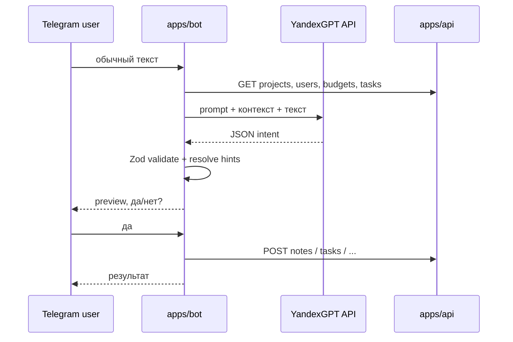

# AI intent (YandexGPT + `@neportal/ai-contracts`)

Локальный MVP: Yandex Cloud используется **только как внешний API** (YandexGPT для текста; SpeechKit — позже). Бот и API работают на `localhost`, без деплоя в Yandex.

## Поток данных



Slash-команды (`/task`, `/note`, …) **не** проходят через YandexGPT.

## Контракт JSON

Пакет: `packages/ai-contracts` (Zod).

```typescript
{
  intent: "create_task" | "create_note" | "create_expense" | "create_absence" | "set_task_deadline" | "complete_task" | "cancel_task" | "unknown",
  confidence: number,        // 0..1
  requiresConfirmation: boolean,
  payload: object            // зависит от intent
}
```

Legacy-поля `version`, `action`, `entity` **не используются**. `preprocessAiIntentInput()` удаляет их, если модель вернула по ошибке.

### Payload по intent

| intent | payload |
|--------|---------|
| `create_task` | `projectHint?`, `assigneeHint?`, `title`, `description?`, `deadlineDate?` (ISO) |
| `create_note` | `projectHint?`, `text` (в тексте даты — **DD.MM.YYYY**) |
| `create_expense` | `projectHint?`, `budgetHint?`, `amount`, `description?` |
| `create_absence` | `userHint?`, `type`: `SICK_LEAVE` \| `VACATION`, `startDate?`, `endDate`, `documentNumber?`, `comment?` |
| `set_task_deadline` | `taskTitle`, `deadlineDate` (ISO) |
| `complete_task` | `taskTitle` |
| `cancel_task` | `taskTitle` |
| `unknown` | `reason?` |

### Пример: закрыть задачу

> Закрой задачу Проверить склад

```json
{
  "intent": "complete_task",
  "confidence": 0.9,
  "requiresConfirmation": true,
  "payload": { "taskTitle": "Проверить склад" }
}
```

### Пример: отменить задачу

> Отмени задачу Проверить склад

```json
{
  "intent": "cancel_task",
  "confidence": 0.9,
  "requiresConfirmation": true,
  "payload": { "taskTitle": "Проверить склад" }
}
```

### Пример: заметка

Запрос пользователя:

> Запиши заметку: клиент попросил завтра проверить статистику VK

Ожидаемый ответ модели:

```json
{
  "intent": "create_note",
  "confidence": 0.9,
  "requiresConfirmation": true,
  "payload": {
    "text": "клиент попросил 22.05.2026 проверить статистику VK"
  }
}
```

Бот дополнительно нормализует ISO-даты в `text` → `22.05.2026` перед сохранением.

## API YandexGPT

- Endpoint: `https://llm.api.cloud.yandex.net/foundationModels/v1/completion`
- Реализация: `apps/bot/src/yandex-gpt.ts`
- Auth (приоритет):
  1. `YANDEX_GPT_API_KEY` → `Authorization: Api-Key <key>`
  2. иначе `YANDEX_CLOUD_IAM_TOKEN` → `Authorization: Bearer <token>`
- Заголовок `x-folder-id`: `YANDEX_CLOUD_FOLDER_ID`

В prompt передаются: текущая дата (UTC ISO), списки проектов, пользователей, бюджетов и задач из REST API — для сопоставления «Вася» → «Вася Пупкин», «реклама VK» → проект/бюджет.

## Загрузка схемы в боте

`apps/bot/src/ai-contracts.ts` подключает собранный `packages/ai-contracts/dist/index.js` по относительному пути, чтобы не попасть на устаревшую копию в `apps/bot/node_modules`.

Перед `pnpm --filter @neportal/bot dev` скрипт `dev` собирает `@neportal/ai-contracts`.

## Функции пакета

| Экспорт | Описание |
|---------|----------|
| `AiIntentSchema` | Zod discriminated union по `intent` |
| `safeParseAiIntent` | Безопасный parse + preprocess |
| `parseAiIntent` | Parse с throw |
| `preprocessAiIntentInput` | Очистка legacy-полей, coerce `confidence` |

## Проверка локально

```bash
docker compose up -d
pnpm db:migrate
pnpm db:seed
pnpm --filter @neportal/api dev
pnpm --filter @neportal/web dev
pnpm --filter @neportal/bot dev
```

1. Slash: `/note Тест` — без Yandex.
2. Текст с настроенным Yandex → preview → `да` → запись в Web (проект «Реклама VK»).

См. также: [bot.md](bot.md), [packages.md](packages.md).
