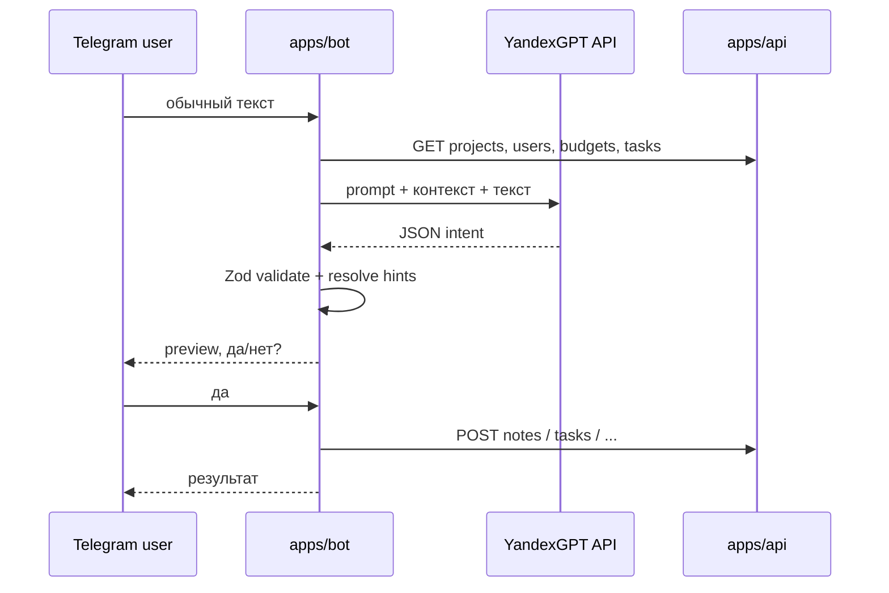

# AI intent (YandexGPT + `@neportal/ai-contracts`)

Локальный MVP: Yandex Cloud используется **только как внешний API** (YandexGPT для текста; SpeechKit — позже). Бот и API работают на `localhost`, без деплоя в Yandex.

## Поток данных



Slash-команды (`/task`, `/note`, …) **не** проходят через YandexGPT.

### Местоимения и `__self__`

Если пользователь говорит о себе («мне», «меня», «себе», «на меня»), модель возвращает `assigneeHint` / `toUserHint` / `userHint` = `"__self__"`. Бот подставляет привязанного сотрудника.

### create_task: исполнитель vs имена в задаче

- **assigneeHint** — только кому назначают задачу («поставь Васе», «поручи Ивану», «мне» → `__self__`).
- Имена **внутри действия** («уволить Васю», «позвонить Ивану») — часть `title`, не исполнитель.
- После YandexGPT для `create_task` срабатывает post-processing (`fix-ai-intent-assignee.ts`): фразы вроде «поставь мне задачу», «запиши мне в задачи» принудительно ставят `assigneeHint: "__self__"`, даже если модель ошибочно взяла имя из title.

Пример:

> Поставь мне задачу проверить склад завтра

```json
{
  "intent": "create_task",
  "confidence": 0.9,
  "requiresConfirmation": true,
  "payload": {
    "assigneeHint": "__self__",
    "title": "Проверить склад",
    "deadlineDate": "2026-05-23"
  }
}
```

### Неоднозначный сотрудник

Если по hint найдено несколько сотрудников (например «Ване» и два Ивана), бот **не** выбирает автоматически — показывает нумерованный список и ждёт номер (см. [bot.md](bot.md#поиск-сотрудника-user-resolution-flow-v1)).

## Контракт JSON

Пакет: `packages/ai-contracts` (Zod).

```typescript
{
  intent: "create_task" | "create_note" | "create_expense" | "create_absence" | "set_task_deadline" | "complete_task" | "cancel_task" | "add_task_comment" | "mention_in_task" | "transfer_task" | "list_my_tasks" | "unknown",
  confidence: number,        // 0..1
  requiresConfirmation: boolean,
  payload: object            // зависит от intent
}
```

Legacy-поля `version`, `action`, `entity` **не используются**. `preprocessAiIntentInput()` удаляет их, если модель вернула по ошибке.

### Payload по intent

| intent | payload |
|--------|---------|
| `create_task` | `projectHint?`, `assigneeHint?`, `title`, `description?`, `deadlineDate?` (ISO) |
| `create_note` | `projectHint?`, `text` (в тексте даты — **DD.MM.YYYY**) |
| `create_expense` | `projectHint?`, `budgetHint?`, `amount`, `description?` |
| `create_absence` | `userHint?`, `type`: `SICK_LEAVE` \| `VACATION`, `startDate?`, `endDate`, `documentNumber?`, `comment?` |
| `set_task_deadline` | `taskTitle`, `deadlineDate` (ISO) |
| `complete_task` | `taskTitle`, `completionResult?` |
| `cancel_task` | `taskTitle`, `cancellationReason?` |
| `add_task_comment` | `taskTitle`, `text?` |
| `mention_in_task` | `userHint`, `taskTitle`, `text?` |
| `transfer_task` | `taskTitle`, `toUserHint`, `comment?` |
| `list_my_tasks` | `{}` (пустой) |
| `unknown` | `reason?` |

### Пример: закрыть задачу (без результата в фразе)

> Закрой задачу поехать к поставщику

```json
{
  "intent": "complete_task",
  "confidence": 0.9,
  "requiresConfirmation": true,
  "payload": { "taskTitle": "Поехать к поставщику" }
}
```

Бот спросит: *«Что сделано по задаче «…»?»*, затем confirmation.

### Пример: закрыть задачу с результатом

> Закрой задачу Проверить склад, всё проверил

```json
{
  "intent": "complete_task",
  "confidence": 0.9,
  "requiresConfirmation": true,
  "payload": {
    "taskTitle": "Проверить склад",
    "completionResult": "всё проверил"
  }
}
```

### Пример: отменить задачу (без причины)

> Отмени задачу проверить склад

```json
{
  "intent": "cancel_task",
  "confidence": 0.9,
  "requiresConfirmation": true,
  "payload": { "taskTitle": "Проверить склад" }
}
```

### Пример: отменить задачу с причиной

> Отмени задачу Проверить склад, склад закрыт

```json
{
  "intent": "cancel_task",
  "confidence": 0.9,
  "requiresConfirmation": true,
  "payload": {
    "taskTitle": "Проверить склад",
    "cancellationReason": "склад закрыт"
  }
}
```

### Пример: комментарий к задаче (с текстом)

> Напиши комментарий к задаче Проверить склад: склад закрыт до завтра

```json
{
  "intent": "add_task_comment",
  "confidence": 0.9,
  "requiresConfirmation": true,
  "payload": {
    "taskTitle": "Проверить склад",
    "text": "склад закрыт до завтра"
  }
}
```

### Пример: комментарий без текста в фразе

> Напиши комментарий к задаче Проверить склад

```json
{
  "intent": "add_task_comment",
  "confidence": 0.85,
  "requiresConfirmation": true,
  "payload": { "taskTitle": "Проверить склад" }
}
```

Бот спросит: *«Что написать в комментарии к задаче «…»?»*, затем confirmation.

### Пример: призвать в задачу (с текстом)

> Позови Васю в задачу Проверить склад, нужны его комментарии

```json
{
  "intent": "mention_in_task",
  "confidence": 0.9,
  "requiresConfirmation": true,
  "payload": {
    "userHint": "Вася",
    "taskTitle": "Проверить склад",
    "text": "нужны его комментарии"
  }
}
```

Confirmation: *«Позвать Вася Пупкин в задачу «…»? Комментарий: …»*

### Пример: призвать без текста

> Попроси Петра прокомментировать задачу Реклама VK

```json
{
  "intent": "mention_in_task",
  "confidence": 0.85,
  "requiresConfirmation": true,
  "payload": { "userHint": "Петр", "taskTitle": "Реклама VK" }
}
```

Бот спросит: *«Что написать в комментарии для … по задаче «…»?»*, затем confirmation.

### Пример: передача задачи

> Передай задачу Проверить склад Васе, потому что он отвечает за склад

```json
{
  "intent": "transfer_task",
  "confidence": 0.9,
  "requiresConfirmation": true,
  "payload": {
    "taskTitle": "Проверить склад",
    "toUserHint": "Вася",
    "comment": "потому что он отвечает за склад"
  }
}
```

OWNER/MANAGER: задача передаётся сразу после «да». EMPLOYEE: запрос на принятие новому исполнителю.

### Пример: мои задачи (без confirmation)

> покажи мои задачи

```json
{
  "intent": "list_my_tasks",
  "confidence": 0.9,
  "requiresConfirmation": false,
  "payload": {}
}
```

Бот сразу вызывает `GET /tasks/my?userId=<linked>&limit=5` и отправляет список (без «да/нет»).

### Пример: заметка

Запрос пользователя:

> Запиши заметку: клиент попросил завтра проверить статистику VK

Ожидаемый ответ модели:

```json
{
  "intent": "create_note",
  "confidence": 0.9,
  "requiresConfirmation": true,
  "payload": {
    "text": "клиент попросил 22.05.2026 проверить статистику VK"
  }
}
```

Бот дополнительно нормализует ISO-даты в `text` → `22.05.2026` перед сохранением.

## API YandexGPT

- Endpoint: `https://llm.api.cloud.yandex.net/foundationModels/v1/completion`
- Реализация: `apps/bot/src/yandex-gpt.ts`
- Auth (приоритет):
  1. `YANDEX_GPT_API_KEY` → `Authorization: Api-Key <key>`
  2. иначе `YANDEX_CLOUD_IAM_TOKEN` → `Authorization: Bearer <token>`
- Заголовок `x-folder-id`: `YANDEX_CLOUD_FOLDER_ID`

В prompt передаются: текущая дата (UTC ISO), списки проектов, пользователей, бюджетов и задач из REST API — для сопоставления «Вася» → «Вася Пупкин», «реклама VK» → проект/бюджет.

## Загрузка схемы в боте

`apps/bot/src/ai-contracts.ts` подключает собранный `packages/ai-contracts/dist/index.js` по относительному пути, чтобы не попасть на устаревшую копию в `apps/bot/node_modules`.

Перед `pnpm --filter @neportal/bot dev` скрипт `dev` собирает `@neportal/ai-contracts`.

## Функции пакета

| Экспорт | Описание |
|---------|----------|
| `AiIntentSchema` | Zod discriminated union по `intent` |
| `safeParseAiIntent` | Безопасный parse + preprocess |
| `parseAiIntent` | Parse с throw |
| `preprocessAiIntentInput` | Очистка legacy-полей, coerce `confidence` |

## Проверка локально

```bash
docker compose up -d
pnpm db:migrate
pnpm db:seed
pnpm --filter @neportal/api dev
pnpm --filter @neportal/web dev
pnpm --filter @neportal/bot dev
```

1. Slash: `/note Тест` — без Yandex.
2. Текст с настроенным Yandex → preview → `да` → запись в Web (проект «Реклама VK»).

См. также: [bot.md](bot.md), [packages.md](packages.md).
