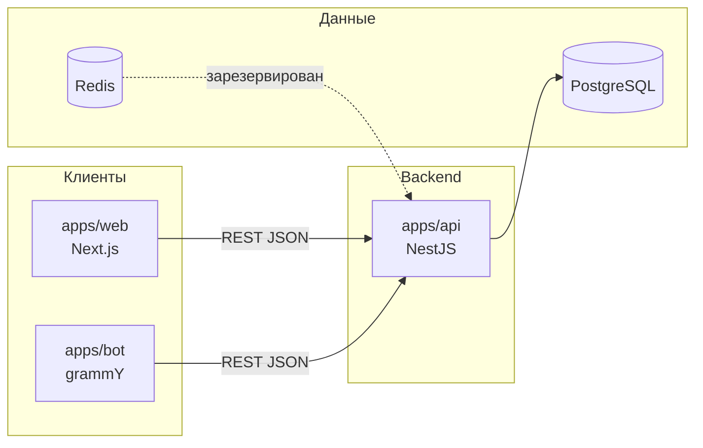

# Архитектура

Карта «что менять в коде» и сценарии онбординга — в [developer-guide.md](developer-guide.md). Справочник переменных — [env.md](env.md).

## Обзор



- **Единый источник правды** — PostgreSQL через Prisma (`packages/database`).
- **Web** и **бот** не ходят в БД напрямую; только через **API**.
- **Организация** в MVP выбирается один раз при старте API (`OrganizationContextService`), не из JWT.

## Структура монорепозитория

```
neportal/
├── apps/
│   ├── web/          # UI (App Router)
│   ├── api/          # REST + Swagger
│   └── bot/          # Telegram long polling / webhook
├── packages/
│   ├── database/     # Prisma schema, client, seed
│   ├── shared/       # loadRootEnv(), общие enum'ы
│   ├── permissions/  # роли/права (заготовка, не в MVP API)
│   └── ai-contracts/ # Zod-схемы для AI intent
├── docker-compose.yml
├── turbo.json
└── .env              # единственный файл окружения для локальной разработки
```

## Контекст организации (MVP)

При старте `apps/api`:

1. Если задан `NEPORTAL_ORGANIZATION_ID` — используется эта запись.
2. Иначе ищется организация по `NEPORTAL_ORG_SLUG` (по умолчанию `neportal-demo`).
3. Если не найдена — приложение падает с подсказкой запустить `pnpm db:seed`.

Все сервисы (projects, tasks, budgets, notes, users) фильтруют данные по `organizationId` из этого контекста.

## Переменные окружения

Полный справочник переменных: [env.md](env.md).

| Механизм | Кто использует |
|----------|----------------|
| `loadRootEnv()` из `@neportal/shared` | API, бот при старте (поиск `.env` вверх по дереву до 8 уровней) |
| `NEPORTAL_ENV_PATH` | Явный путь к `.env` в ОС (до запуска Node) |
| `dotenv-cli -e .env` | Скрипты `pnpm db:*` из корня |
| `dotenv-cli` + `../../.env` | `@neportal/web` dev/build/start |

**Важно:** все команды `pnpm`, `pnpm db:*`, `pnpm --filter …` выполнять из **корня** клона, чтобы `cwd` и пути к `.env` совпадали с ожидаемыми (особенно на Windows).

## Сборка (Turborepo)

- `build` зависит от `^build` (сначала пакеты, потом приложения).
- `dev` — persistent, без кэша, тоже после `^build`.
- Артефакты: `dist/**` (Nest, bot), `.next/**` (web).

## Безопасность (текущее состояние)

| Область | Статус |
|---------|--------|
| JWT / сессии | В `.env.example` есть `JWT_SECRET`; в MVP API **не используется** |
| CORS | Стандартная настройка Nest |
| Мульти-тенант | Только одна org в runtime |
| Telegram file open | API запрашивает `getFile` у Bot API, редирект на URL файла; токен бота не отдаётся клиенту в JSON |

## AI intent (реализовано в MVP)

- **`@neportal/ai-contracts`** — Zod-контракт `intent` + `payload` для ответа парсера.
- **`apps/bot`** — текст без `/`: сначала **детерминированные парсеры**, затем при необходимости **двухэтапный LLM** (`parseTextIntent` → `AiProvider.complete`: по умолчанию YandexGPT Foundation API, опционально Qwen через OpenAI-compatible endpoint Yandex Cloud) → подтверждение → REST API.
- Yandex Cloud **не хостит** приложение в MVP; вызываются только внешние HTTP API (Foundation Models и/или AI Studio).
- SpeechKit (голос → текст) — env в `.env.example`, код не подключён.

Подробнее: [ai-intent.md](ai-intent.md), [bot.md](bot.md).

## Планируемые направления (по схеме и env)

- Redis — очереди, кэш, напоминания (`Reminder` в БД).
- S3 — постоянное хранение вложений (сейчас чеки через `telegramFileId`).
- SpeechKit — голосовые команды в боте.
- Пакет `permissions` — отдельная модель ролей; в Prisma уже есть `UserRole` / `ProjectRole`.
