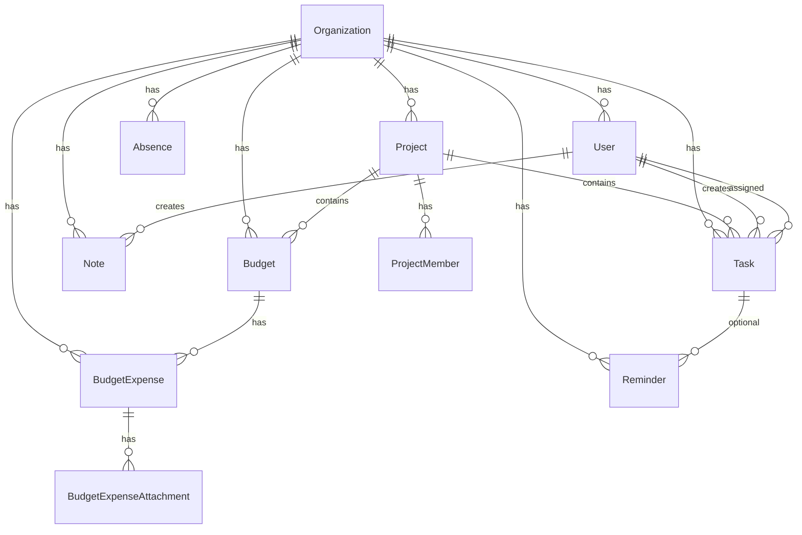

# База данных

Схема: `packages/database/prisma/schema.prisma`  
Клиент: `@neportal/database` (`PrismaClient` + Nest `PrismaModule`).

## ER-обзор (упрощённо)



## Ключевые сущности

### Organization

Мультитенант на уровне данных; в MVP API работает с одной записью. Поля: `name`, `slug` (unique), `status`.

### User

- Роли org: `OWNER`, `MANAGER`, `EMPLOYEE`, `ACCOUNTANT` (`UserRole`).
- Опционально `telegramId` (unique) - связь с Telegram после подтверждения в боте.
- Опционально `telegramUsername` - для **первичной** привязки в боте (unique в рамках `organizationId`; несколько `NULL` допустимы). Нормализация: trim, без `@`, lowercase.
- `systemAliases` - строка псевдонимов через запятую (генерация из ФИО: `generateSystemAliases` в `@neportal/shared`); используется ботом и LLM-контекстом (`intent-context.ts`) для распознавания имён. Backfill: `pnpm users:aliases:backfill`.
- `telegramId` - постоянная связь после `/start`; отвязка (`DELETE /users/:id/telegram`) или архивация сотрудника обнуляет `telegramId` и `telegramUsername`.
- `status` - `ARCHIVED` при soft delete (`DELETE /users/:id`).
- Связи: проекты, задачи, бюджеты, расходы, отсутствия, напоминания.

### Project

- `createdBy`, участники через `ProjectMember` с ролями `MANAGER`, `MEMBER`, `VIEWER`.
- Дочерние: tasks, budgets.

### Task

Статусы: `NEW`, `IN_PROGRESS`, `DONE`, `CANCELLED`.  
Обязательно `projectId` (FK `ON DELETE RESTRICT`). Опционально `assigneeId`, `deadlineAt`, `completedAt`, `cancelledAt`.

### Note

Личная заметка пользователя (`creatorId`), без привязки к проекту. Источник: `WEB`, `TELEGRAM_TEXT`, `TELEGRAM_VOICE`. Доступ через API только с `actorUserId` (автор).

### Budget

- Обязательно `projectId` (FK `ON DELETE RESTRICT`).
- `initialAmount`, `spentAmount` (подтверждённые расходы), `currency` (по умолчанию RUB).
- Статус: `ACTIVE`, `ARCHIVED`.
- `requiresReceipt` - обязательность чека для подтверждения расхода.
- `matchingKeywords` - ключевые слова через запятую для сопоставления расходов в Telegram-боте (`budget-resolver.ts`); задаются в Web.
- Архивация: `archivedAt`, `archivedById`, `archiveReason`.
- `BudgetAccess` - доступ сотрудников к бюджету (`@@unique([budgetId, userId])`).

### BudgetExpense

- Статус: `PENDING_RECEIPT`, `APPROVED` (`BudgetExpenseStatus`).
- Источник: `WEB`, `TELEGRAM_TEXT`, `TELEGRAM_VOICE`.
- При `requiresReceipt` и создании без чека - `PENDING_RECEIPT`; после вложения - `APPROVED` и инкремент `spentAmount`.

### BudgetExpenseAttachment

- `storageKey` - для S3 (nullable).
- `telegramFileId` - для чеков из бота.
- `uploadedBy` - пользователь, загрузивший файл.

### Absence

- Типы: `SICK_LEAVE`, `VACATION` (`AbsenceType`).
- Статусы: `PENDING`, `APPROVED`, `REJECTED`, `CANCELLED` (`AbsenceStatus`); при создании через бота/API MVP по умолчанию `APPROVED`. Отмена через Web/Telegram - `CANCELLED` (запись в БД сохраняется).
- Поля: `userId`, `startDate`, `endDate`, опционально `documentNumber`, `comment`; при отмене: `cancelledAt`, `cancelledById`, `cancellationReason`, связь `cancelledBy` → `User`.
- REST: модуль `AbsencesModule` - см. [api.md](api.md).
- В выдаче по проекту - `affectedTasks` (задачи исполнителя с `deadlineAt` в периоде отсутствия, статус `NEW` / `IN_PROGRESS`).
- `AbsenceNotificationLog` - идемпотентный лог Telegram-уведомлений (`AbsenceNotificationType`: employee summary per task, creator warning, creator notified on delegation).
- Связь с передачей задач: `TaskTransfer.absenceId` (optional) - передача из-за отсутствия.

### TaskTransfer (дополнение)

- `absenceId` - optional FK на `Absence`; при accept бот уведомляет постановщика (`ABSENCE_TASK_DELEGATED_CREATOR`).

### Reminder

Модель для напоминаний по задачам; UI и API в MVP не реализованы.

## Enum'ы (кратко)

| Enum | Значения |
|------|----------|
| EntityStatus | ACTIVE, ARCHIVED, DELETED |
| TaskStatus | NEW, IN_PROGRESS, DONE, CANCELLED |
| BudgetStatus | ACTIVE, ARCHIVED |
| BudgetExpenseStatus | PENDING_RECEIPT, APPROVED |
| AbsenceType | SICK_LEAVE, VACATION |
| AbsenceStatus | PENDING, APPROVED, REJECTED, CANCELLED |
| AbsenceNotificationType | ABSENCE_AFFECTED_TASKS_EMPLOYEE, ABSENCE_AFFECTED_TASK_CREATOR, ABSENCE_TASK_DELEGATED_CREATOR |
| ReminderStatus | SCHEDULED, SENT, CANCELLED |

Дублирование части enum'ов в `@neportal/shared` - для кода вне Prisma (см. [packages.md](packages.md)).

## Миграции

Файлы: `packages/database/prisma/migrations/`.

Из корня:

```bash
pnpm db:migrate    # prisma migrate dev
pnpm db:generate   # только клиент
pnpm db:push       # без файлов миграций
pnpm db:studio     # GUI
```

**Не** вызывайте Prisma из `packages/database` без `dotenv -e .env` из корня - `DATABASE_URL` не подставится.

### Служебные скрипты (корень)

| Команда | Назначение |
|---------|------------|
| `pnpm users:aliases:backfill` | Заполнить `User.systemAliases` из ФИО |
| `pnpm projectId:nulls` / `projectId:backfill` | Диагностика/миграция legacy `projectId` у задач |
| `pnpm note:projectId:linked` / `note:projectId:nullify` | Экспорт и обнуление legacy `Note.projectId` (если колонка ещё есть в БД) |

## Демо-данные (seed)

Команда: `pnpm db:seed`  
Скрипт: `packages/database/prisma/seed.ts`

Перед созданием удаляется org с `slug = neportal-demo` (сначала `BudgetExpenseAttachment`, иначе FK на `uploadedById`), затем org создаётся заново:

| Сущность | Детали |
|----------|--------|
| Организация | Neportal Demo, `neportal-demo` |
| Пользователи | Иван (OWNER), Вася, Петр (EMPLOYEE), Мария (ACCOUNTANT) |
| `telegramUsername` | `demo_ivan`, `demo_vasya` - не реальные username |
| `telegramId` | `seed-demo-ivan` у Ивана; у Васи пусто до `/start` |
| Проект | «Реклама VK», участники с ролями |
| Бюджет | 50 000 RUB, название «Реклама VK» |
| Задачи | «Подготовить отчет» (Вася); «Подписать договор с подрядчиком» (Иван, deadline конец 22.05.2026 UTC - `ensureDemoContractTask`, без дублей) |

Проект **«Реклама VK»** в seed - демо-данные для локальной разработки; бот **не** использует его как проект по умолчанию (Stage 6A, см. [bot.md](bot.md#проект-и-бюджет-stage-6a-6b)).
