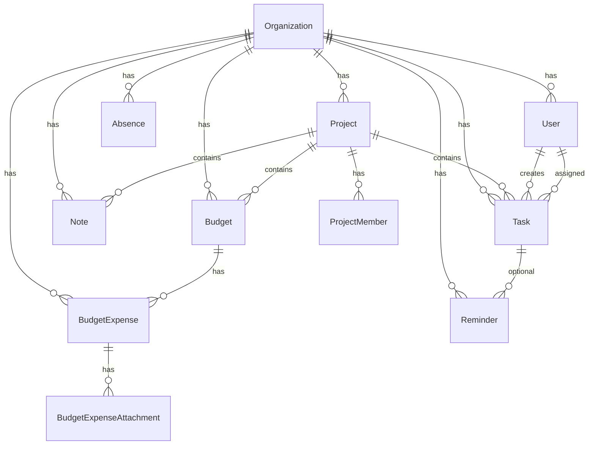

# База данных

Схема: `packages/database/prisma/schema.prisma`  
Клиент: `@neportal/database` (`PrismaClient` + Nest `PrismaModule`).

## ER-обзор (упрощённо)



## Ключевые сущности

### Organization

Мультитенант на уровне данных; в MVP API работает с одной записью. Поля: `name`, `slug` (unique), `status`.

### User

- Роли org: `OWNER`, `MANAGER`, `EMPLOYEE`, `ACCOUNTANT` (`UserRole`).
- Опционально `telegramId` (unique) — связь с Telegram.
- Связи: проекты, задачи, бюджеты, расходы, отсутствия, напоминания.

### Project

- `createdBy`, участники через `ProjectMember` с ролями `MANAGER`, `MEMBER`, `VIEWER`.
- Дочерние: tasks, notes, budgets.

### Task

Статусы: `NEW`, `IN_PROGRESS`, `DONE`, `CANCELLED`.  
Опционально `projectId`, `assigneeId`, `deadlineAt`, `completedAt`, `cancelledAt`.

### Note

Источник: `WEB`, `TELEGRAM_TEXT`, `TELEGRAM_VOICE`. Текст + привязка к проекту.

### Budget

- `initialAmount`, `spentAmount`, `currency` (по умолчанию RUB).
- Статус: `ACTIVE`, `EXHAUSTED`, `ARCHIVED`.

### BudgetExpense

- Статус: `PENDING`, `APPROVED`, `REJECTED`, `CANCELLED`.
- Источник: `WEB`, `TELEGRAM_TEXT`, `TELEGRAM_VOICE`.
- Согласование: `approvedById`, `approvedAt`.

### BudgetExpenseAttachment

- `storageKey` — для S3 (nullable).
- `telegramFileId` — для чеков из бота.
- `uploadedBy` — пользователь, загрузивший файл.

### Absence / Reminder

Модели в схеме для отпусков/больничных и напоминаний по задачам; UI и полный API могут быть не реализованы в MVP.

## Enum'ы (кратко)

| Enum | Значения |
|------|----------|
| EntityStatus | ACTIVE, ARCHIVED, DELETED |
| TaskStatus | NEW, IN_PROGRESS, DONE, CANCELLED |
| BudgetStatus | ACTIVE, EXHAUSTED, ARCHIVED |
| ExpenseStatus | PENDING, APPROVED, REJECTED, CANCELLED |
| AbsenceType | SICK_LEAVE, VACATION |
| AbsenceStatus | PENDING, APPROVED, REJECTED |
| ReminderStatus | SCHEDULED, SENT, CANCELLED |

Дублирование части enum'ов в `@neportal/shared` — для кода вне Prisma (см. [packages.md](packages.md)).

## Миграции

Файлы: `packages/database/prisma/migrations/`.

Из корня:

```bash
pnpm db:migrate    # prisma migrate dev
pnpm db:generate   # только клиент
pnpm db:push       # без файлов миграций
pnpm db:studio     # GUI
```

**Не** вызывайте Prisma из `packages/database` без `dotenv -e .env` из корня — `DATABASE_URL` не подставится.

## Демо-данные (seed)

Команда: `pnpm db:seed`  
Скрипт: `packages/database/prisma/seed.ts`

Перед созданием удаляется org с `slug = neportal-demo`, затем создаётся заново:

| Сущность | Детали |
|----------|--------|
| Организация | Neportal Demo, `neportal-demo` |
| Пользователи | Иван (OWNER), Вася, Петр (EMPLOYEE), Мария (ACCOUNTANT) |
| `telegramId` | `seed-demo-ivan`, `seed-demo-vasya`, … — не пересекаются с реальными Telegram ID |
| Проект | «Реклама VK», участники с ролями |
| Бюджет | 50 000 RUB, название «Реклама VK» |
| Задача | «Подготовить отчет», автор Иван, исполнитель Вася |

Бот и документация предполагают проект **«Реклама VK»** как проект по умолчанию.
