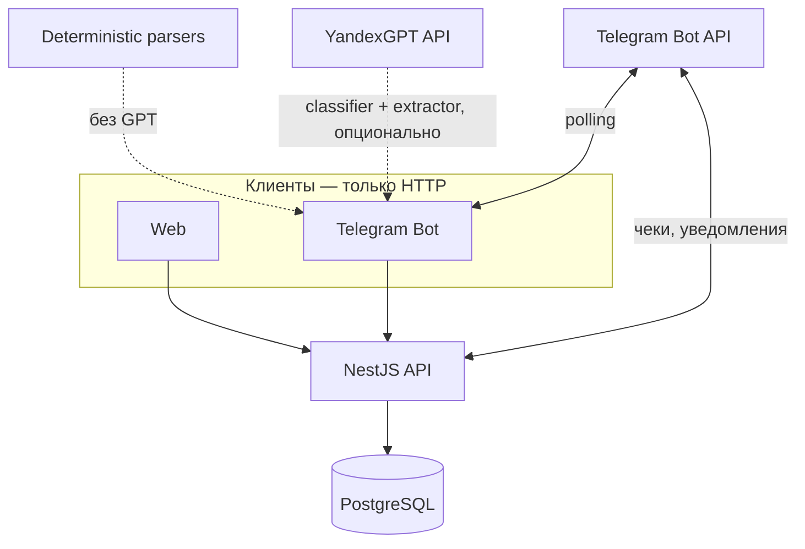

# Руководство разработчика

Документ для онбординга: за **30–60 минут** можно поднять окружение, понять архитектуру и знать, куда смотреть при типовых задачах. Детали по подсистемам — в остальных файлах [docs/](README.md).

## Что это за проект

**Neportal** — внутренний портал организации: проекты, задачи, заметки, бюджеты и расходы, сотрудники, отсутствия. Кратко для нетехнической аудитории — [корневой README.md](../README.md). Три клиента работают с **одним REST API** и **одной PostgreSQL**:

| Клиент | Технология | Роль |
|--------|------------|------|
| `apps/web` | Next.js 15 | Веб-UI для руководителя и учёта |
| `apps/bot` | grammY | Telegram: команды и AI-разбор текста |
| `apps/api` | NestJS | Единственный доступ к БД |

В MVP **нет логина**: API обслуживает одну организацию (`neportal-demo` после сида). Это осознанное ограничение для локальной разработки, не продакшен-модель безопасности.

## С чего начать (день 1)

1. Прочитать этот файл и [getting-started.md](getting-started.md).
2. Выполнить быстрый старт из корневого [README.md](../README.md).
3. Открыть в браузере: Web `http://localhost:3000`, Swagger `http://localhost:4000/docs`.
4. Пройти **сквозной сценарий** ниже (сотрудник → бот → Web).
5. По задаче углубиться: [api.md](api.md), [web.md](web.md), [bot.md](bot.md), [database.md](database.md).

Все команды `pnpm` — **только из корня** репозитория (`c:\neportal` или аналог). Иначе `.env` и Prisma не найдут `DATABASE_URL`.

## Ментальная модель



**Правила, которые экономят время:**

- Web и бот **не импортируют** `@neportal/database` — только `fetch` к API.
- Любая запись в БД идёт через **сервис NestJS**, который фильтрует по `organizationId` из `OrganizationContextService`.
- Бот после подтверждения AI или slash-команды вызывает **те же REST-эндпоинты**, что и Web (обёртки в `apps/bot/src/api.ts`).
- In-memory состояние бота (pending AI, «последний расход») **теряется при перезапуске** процесса бота.

## Карта репозитория: «мне нужно изменить…»

| Задача | Куда смотреть |
|--------|----------------|
| Схема БД, миграции, сид | `packages/database/prisma/` → [database.md](database.md) |
| Новый REST-эндпоинт | `apps/api/src/<domain>/` (controller, service, dto) → [api.md](api.md) |
| Фильтр по организации | `apps/api/src/organization/organization-context.service.ts` |
| Уведомление в Telegram с API | `apps/api/src/telegram/telegram-notify.service.ts` |
| Страница / форма в Web | `apps/web/src/app/(app)/` + `src/lib/api.ts` → [web.md](web.md) |
| Команда бота или AI | `apps/bot/src/main.ts`, `api.ts`, `ai-message.ts` → [bot.md](bot.md) |
| Детерминированный parse текста | `parse-expense-query.ts`, `parse-create-budget-command.ts`, `ai/deterministic/` |
| YandexGPT (2 шага) | `yandex-gpt.ts`, `ai/prompts/`, `ai/prompt-group-router.ts` |
| Выбор бюджета по ключевым словам | `budget-resolver.ts`, поле `matchingKeywords` в Web/API |
| Исполнитель в «создай задачу Маше…» | `create-task-assignee-extract.ts` |
| Псевдонимы сотрудников | `packages/shared/src/name-aliases/`, `User.systemAliases`, `pnpm users:aliases:backfill` |
| Контракт ответа YandexGPT | `packages/ai-contracts/src/index.ts` → [ai-intent.md](ai-intent.md) |
| Загрузка `.env` | `packages/shared/src/env/load-root-env.ts` → [env.md](env.md) |
| Общие enum вне Prisma | `packages/shared/src/enums.ts` |
| RBAC (пока не в API) | `packages/permissions/` |

### Структура NestJS-модуля (API)

Каждый домен — папка в `apps/api/src/`:

```
<domain>/
├── <domain>.module.ts
├── <domain>.controller.ts   # маршруты, DTO из query/body
├── <domain>.service.ts        # Prisma, organizationId, бизнес-правила
└── dto/                       # class-validator + Swagger при необходимости
```

Пример: задачи — `tasks/tasks.controller.ts`, `tasks/tasks.service.ts`. Паттерн: в сервисе `this.orgContext.getOrganizationId()` и `where: { organizationId }`.

### Структура Web (App Router)

```
apps/web/src/
├── app/(app)/          # страницы с AppShell (меню)
├── app/(app)/.../actions.ts   # Server Actions → apiPostJson / apiPatchJson
├── components/         # AppShell, ProjectTabs, …
└── lib/api.ts          # серверный fetch к API
```

Мутации — через **Server Actions** рядом со страницей, затем `revalidatePath`. Списки — **Server Components** + `apiGet`.

### Структура бота

| Файл | Ответственность |
|------|-----------------|
| `main.ts` | Регистрация `bot.command`, фото/документов, делегирование в handlers |
| `api.ts` | HTTP-клиент к REST, выбор проекта/бюджета по умолчанию |
| `start-binding.ts` | `/start`, привязка по username |
| `ai-message.ts` | Текст без `/`: pending → deterministic → YandexGPT → preview |
| `route-parsed-intent.ts` | Общий путь после parse (deterministic или GPT) |
| `budget-resolver.ts` | Сопоставление расхода с бюджетом по `matchingKeywords` |
| `intent-resolver.ts` / `intent-executor.ts` | hints → id → POST/PATCH API |
| `pending-intent.ts` | In-memory очередь подтверждений |

## Глоссарий домена

| Термин | Значение |
|--------|----------|
| **Organization** | Тенант в данных; в runtime MVP — одна запись (`neportal-demo`) |
| **User** | Сотрудник org: роль `OWNER` / `MANAGER` / `EMPLOYEE` / `ACCOUNTANT` |
| **Project** | Проект с участниками (`ProjectMember`) |
| **Task** | Задача, опционально в проекте; статусы `NEW` … `CANCELLED` |
| **Note** | Текстовая заметка; источник `WEB` / `TELEGRAM_*` |
| **Budget** | Лимит денег на проект; `spentAmount` обновляется при одобрении расхода |
| **BudgetExpense** | Строка расхода; чек — `BudgetExpenseAttachment` (`telegramFileId`) |
| **Absence** | Больничный / отпуск; при выдаче по проекту — `affectedTasks` |
| **telegramUsername** | Для **первой** привязки через `/start` (до появления `telegramId`) |
| **telegramId** | Постоянная связь с Telegram после подтверждения «да» |

Демо-проект **«Реклама VK»** — проект и бюджет по умолчанию в боте; без него slash-команды просят создать проект в Web.

## Сквозные сценарии (проверка понимания)

### 1. Сотрудник и Telegram

1. Web `/employees` → добавить сотрудника с username `demo_vasya` (из сида у Васи пустой `telegramId`).
2. В Telegram от имени этого username: `/start` → «да».
3. Web: статус **Привязан**; `/me` в боте показывает ФИО.
4. `DELETE /users/:id/telegram` в Web → уведомление в Telegram, команды бота недоступны до нового `/start`.

Подробнее: [bot.md](bot.md#привязка-telegram-username-flow), [web.md](web.md#сотрудники-и-telegram-employees).

### 2. Расход и чек

1. Бот (привязанный пользователь): `/expense 1500 тест`.
2. Отправить **фото** или **документ** — вложение к последнему расходу.
3. Web: `/budgets/[id]` → модальный просмотр через `GET .../preview` (API проксирует файл из Telegram).

### 3. AI intent (если настроен Yandex)

1. Фраза: «Запиши заметку: тест AI».
2. Preview → ответ `да`.
3. Web: вкладка «Заметки» проекта по умолчанию.

Контракт JSON: [ai-intent.md](ai-intent.md).

### 4. Отсутствие и затронутые задачи

1. `/sick до 25.05.2026` от привязанного Ивана (в сиде есть задача с дедлайном 22.05.2026).
2. Web: проект → «Отсутствия» — в карточке отсутствия список `affectedTasks`.

### 5. Бюджет через бот (deterministic или Yandex)

1. Фраза: «создай бюджет Тестовый 100000 с чеком» (или через Yandex, если deterministic не сработал).
2. Preview → `да`.
3. Web: проект → «Бюджеты» — новый бюджет; при необходимости допишите **ключевые слова** на карточке бюджета.

## Как вносить изменения

### Новое поле в БД

1. Правка `packages/database/prisma/schema.prisma`.
2. `pnpm db:migrate` (имя миграции ввести в терминале).
3. `pnpm db:generate` (часто уже в migrate).
4. Обновить DTO/сервисы API, при необходимости типы в `apps/web/src/lib/types.ts` и сид `prisma/seed.ts`.

### Новый REST-эндпоинт

1. DTO в `dto/` с `class-validator`.
2. Метод в `*.service.ts` с проверкой `organizationId`.
3. Маршрут в `*.controller.ts`.
4. Зарегистрировать модуль в `app.module.ts`, если новый домен.
5. Описать в [api.md](api.md); Swagger подтянется из декораторов при их наличии.

### Новая страница Web

1. Файл в `apps/web/src/app/(app)/.../page.tsx`.
2. Данные: `apiGet` из `src/lib/api.ts`.
3. Форма: `actions.ts` + `apiPostJson` / `apiPatchJson` + `revalidatePath`.
4. При необходимости пункт в `AppShell` или `ProjectTabs`.

### Новая slash-команда бота

1. Обработчик в `main.ts` через `bot.command("name", ...)`.
2. Бизнес-логика — функция в `api.ts` (не дублировать URL вручную в handler).
3. Для команд с датами — `parse-ru-date.ts` (формат **DD.MM.YYYY**).
4. Рабочие команды: `requireLinkedUser` из `current-user.ts`.
5. Документировать в [bot.md](bot.md).

**Важно:** в grammY сообщения вида `/sick …` **не попадают** в `bot.hears` — только `bot.command`.

### Новый AI intent

1. Расширить Zod в `packages/ai-contracts/src/index.ts`.
2. `pnpm --filter @neportal/ai-contracts build`.
3. Prompt в `yandex-gpt.ts`, resolver/preview/executor в боте.
4. [ai-intent.md](ai-intent.md) + пример фразы в [bot.md](bot.md).

## Инструменты и сборка

| Инструмент | Версия / заметка |
|------------|------------------|
| Node | ≥ 20 |
| pnpm | 11 (`packageManager` в корневом `package.json`) |
| Turborepo | `build` → `^build` сначала пакеты, потом apps |
| Prisma | CLI через `pnpm db:*` с `dotenv-cli` |
| Тесты | Автотестов в репозитории **нет**; проверка — ручные сценарии выше + Swagger |

Запуск одного приложения:

```bash
pnpm --filter @neportal/api dev
pnpm --filter @neportal/web dev
pnpm --filter @neportal/bot dev
```

Линт: `pnpm lint` (на API/bot — заглушка; ESLint на web).

## Переменные окружения

Полная таблица: [env.md](env.md). Кратко: один файл `.env` в **корне**, шаблон `.env.example`.

## Отладка

| Симптом | Действие |
|---------|----------|
| API не стартует, org not found | `pnpm db:seed`, проверить `NEPORTAL_ORG_SLUG` |
| Бот: не привязан | Web: username + `/start` + «да» |
| Бот: AI не работает | Slash без Yandex; для текста — [env.md](env.md) YandexGPT |
| Web: чек не открывается | `NEXT_PUBLIC_API_URL`, API запущен, `TELEGRAM_BOT_TOKEN` на API |
| Zod `version` в боте | `pnpm --filter @neportal/ai-contracts build`, перезапуск бота |
| Prisma без URL | Команды из корня, не из `packages/database` |

Логи бота (без секретов): `BOT_DEV_LOG` не равен `0` — POST `/absences`, Yandex validation.

## Что сознательно не в MVP

- JWT / сессии / мульти-org в runtime
- Пакет `@neportal/permissions` в Nest
- Redis, S3, SpeechKit (env есть, код частично или нет)
- `Reminder` в БД без UI/API
- Webhook-сервер для Telegram (только `BOT_MODE=webhook` + установка URL)
- Автотесты

Планы — раздел «Планируемые направления» в [architecture.md](architecture.md).

## Дальнейшее чтение

| Документ | Когда |
|----------|--------|
| [getting-started.md](getting-started.md) | Установка с нуля |
| [architecture.md](architecture.md) | Потоки, env, Turborepo |
| [api.md](api.md) | Контракт REST |
| [database.md](database.md) | Модели Prisma |
| [web.md](web.md) | Маршруты Next.js |
| [bot.md](bot.md) | Команды, чеки, привязка |
| [ai-intent.md](ai-intent.md) | YandexGPT JSON |
| [packages.md](packages.md) | Workspace-пакеты |
